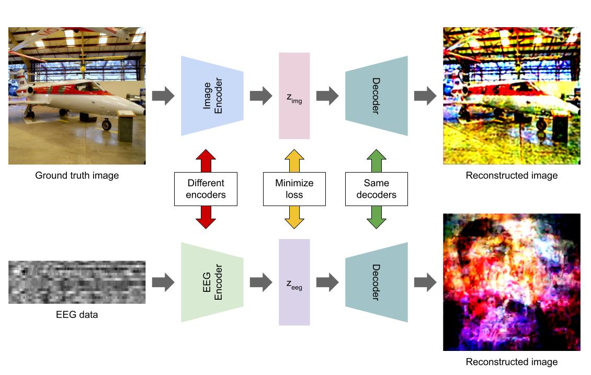

# Visual Reconstruction with EEG
⚠️ This repository is messy! We're still in development and have yet to clean up the code. ⚠️
<br>  
Reconstructing stimulus images from EEG data, with an emphasis on shape, color, and image structure over semantic accuracy. The main pipeline trains an EEG encoder to predict downsampled Stable Diffusion VAE latents, then decodes those predictions back into images.



## Results

Example reconstructions:


"Label only" images are reconstructed using Stable Diffusion text to image, with text coming from the EEG classifier.  
"Label + EEG image" images are reconstructed using Stable Diffusion image to image, with text coming from the EEG classifier and EEG image coming from the encoder.

## Setup

1. Create and activate a Python environment. We used Python 3.12.3.

   ```bash
   python -m venv .venv
   source .venv/bin/activate
   python -m pip install --upgrade pip
   pip install -r requirements.txt
   ```

2. Download [THINGS EEG2](https://osf.io/3jk45/overview). We used the [preprocessed data](https://osf.io/anp5v/overview).

3. Download [THINGS images](https://osf.io/jum2f/files/rdxy2).

4. Arrange the data under `datasets/`:

   ```text
   datasets/
     THINGS_EEG_2/
       image_metadata.npy
       sub-1/
         preprocessed_eeg_training.npy
       sub-2/
         preprocessed_eeg_training.npy
       ...
     images_THINGS/
       object_images/
         <class_name>/
           <image files>
   ```

5. Extract image targets for the EEG encoder. This command writes full SD-VAE latents and standardized PCA latents to `latents/`.

   ```bash
   python scripts/vae_extract_image_embeds.py \
     --embedding-type both \
     --full-dir-name img_full \
     --pca-dir-name img_pca_4 \
     --n-components 4 \
     --standardize-pca \
     --pca-scope train \
   ```

   If you use a different PCA dimensionality, set `image_latent_root` and `output_dim` in `configs/eeg_encoder.yaml` to the same dimension.

## Quick Training And Testing

Train the EEG encoder:

```bash
python scripts/train_eeg_encoder.py \
  --config configs/eeg_encoder.yaml \
  --image-latent-root latents/img_pca_4 \
  --output-dim 4 \
  --output-dir outputs/eeg_encoder \
```

Evaluate an encoder checkpoint and save decoded reconstructions:

```bash
python src/evaluation/eval_eeg_encoder.py \
  --checkpoint-path outputs/eeg_encoder/eeg_encoder_best_YYYYMMDD_HHMMSS.pt \
  --latent-root latents/img_pca_4 \
  --max-samples 16 \
  --grid-images 8 \
```

For a full train-then-evaluate run with a timestamped output directory:

```bash
bash scripts/run_eeg_encoder_experiment.sh \
  --config configs/eeg_encoder.yaml \
  --eval --max-samples 16 --grid-images 8 \
```

Train the 20-class EEG classifier:

```bash
python scripts/train_eeg_classifier.py \
  --config configs/eeg_classifier.yaml \
  --dataset-root datasets \
  --subjects all \
  --output-dir outputs/eeg_classifier \
  --device cuda
```

Evaluate a classifier checkpoint:

```bash
python scripts/eval_eeg_classifier.py \
  --checkpoint-path outputs/eeg_classifier/run_YYYYMMDD_HHMMSS/eeg_classifier20_best_YYYYMMDD_HHMMSS.pt \
  --split test \
  --device cuda
```

Training artifacts are written under `outputs/eeg_encoder/` and `outputs/eeg_classifier/`. Evaluation writes decoded images, reconstruction grids, metrics, predictions, and confusion matrices under each run's `eval/` directory.
